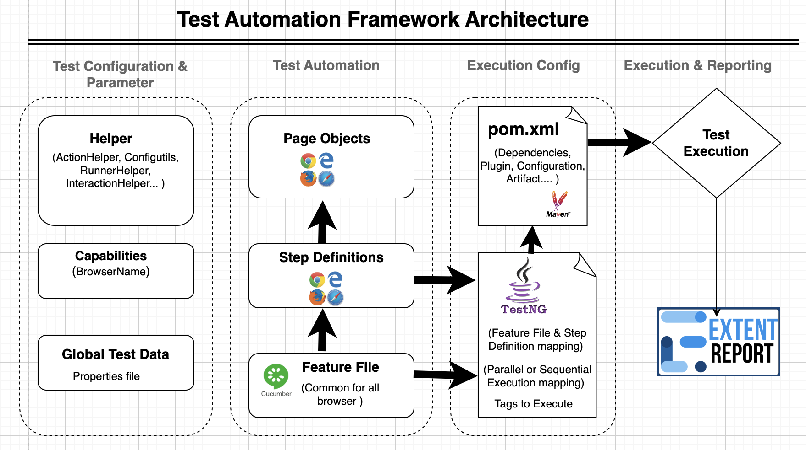

## Overview
This framework that helps you to write automation tests for E2E using selenium with cucumber

### Test Automation Framework Architecture

## Prerequisite

#### Test application
Core Product: https://www.nba.com/warriors 
Derived Product 1: https://www.nba.com/sixers/
Derived Product 2: https://www.nba.com/bulls/ 

#### Plugins needed
* Cucumber for Java
* Gherkin
* Lombok
* Maven
* TestNG

## Test Execution

### We can execute the test in different ways
* Locally
	* Through maven
		* `mvn clean test` to execute test from `testng.xml` through maven.
		* To execute specific tags from command line we can use mvn test -> `-Dcucumber.filter.tags="@All"`
		* Can pass browser type and execution type from maven cli -> mvn test `-Dcucumber.filter.tags="@All" -Dbrowser=firefox -DexecType=local`
		* Default value for browser and execType is chrome and local
	* Through `testng.xml`
	* Through the `TestRunner.java` class
  
* Rerun failed cases: Add `rerun:target/failed_scenario.txt` in the plugin section.

The execution in the framework starts from the `cucumberOptions.TestRunner.java` class. The tests to be executed are defined in the feature files located in the Features folder. The specific test cases are identified by the appropriate tag names in the tags section configured in TestNG within the TestRunner class.

## Test Execution Configurations

* **Execution mode(parallel or sequentially):** In scenarios method in `cucumberOptions.TestRunner.java` class, we can set if the test need to execute parallel or sequentially. Set the parallel flag to true or false.
	* The default test case count executing at a time is specified in the `testng.xml`, The default value is `2`
* **Report configuration:** Test report high level(suit level) configured will be done through `@BeforeClass` and `@AfterClass` annotations of TestNG inside TestRunner class. Each scenario wise step will be added to report through `stepDefinitions.Hooks`.

**RunnerHelper** class will be shared among `runners.TestRunner` and `runners.FailedTCRunner` class to implement code re-usability.

## Test case creation
Test cases are defined in the Features folder in the form of `.feature` file. 

**Test steps(test.java.stepDefinitions)**
* This package contain all the step defined in the feature file 

## Read Test Data
Test data reading start from test data path provided in step defined in the feature file.Since we want to support the parallel execution hence we are using factory method and thread-local class to create TestDataModel per test case using TestDataFactory. In this way each scenario will have its own TestData and will be executed in separate thread.

## Test reporting:

**Suit level configuration:**
Test report high level(suit level) configured will be done through `@BeforeClass` and `@AfterClass` annotations of TestNG inside TestRunner class. each scenario wise step will be added to report through `stepDefinitions.Hooks`

**Scenario level configuration:**
Each common scenario operations like opening and closing Chrome browser, starting and closing test scenario, Adding screenshots for passed test etc. are done through Cucumber hooks present in the com.stepDef.Hooks class. We are using `@Before` and `@After` hooks of cucumber to achieve this.

**Step level configuration:**
For test step status management are using listener class named `java.utils.TestListener` which implements cucumber plugin `ConcurrentEventListener`. Using this plugin we are managing the status of the test cases by monitoring test steps. We are handling three main status **FAILED, PASSED, SKIPPED**.

## Scenario context
All the operations which are common in scenario level like **driver management, data passing between test step** are 
done through `java.utils.TestContext`. i.e. During the execution if we want to share the driver or store the order number in one step and use that order number in different step, then we need to use TestContext.
* TestContext is marked with `@ScenarioScoped`, so the class will have separate copy of instance for each scenario
* TestContext contain a map we can use this map to manipulate data.
* We are using google-guice for DI

## Configuration:
Configurations for the test suits are done through `java.utils.ConfigUtil` interface which extends `org.aeonbits.owner.Config`. Suit level configuration are done in `TestContext` class.

## Logs:
We are using `slf4j` to implement `log4j` through `lombok`

## Other utils:
**WaitHelper:** This helper class contains all the type of waits for the framework. like JS wait, explicit wait etc...

## Test output
* The output of the test execution can be logged in report for the later use, so 
  didn't create any other mechanism for that.

## Other Features
* Added testng file so that we can control the thread count in parallel mode
* In the current framework we have optimised the page management by combining POM with step def files, By doing so it is easily manageable, also creating new test case require only small effort.
* Added `google-juice` and `cucumber-juice` for managing the state of driver object, class object etc
* Added the `@ScenarioScoped`(the object of a class marked this annotation is only created for one scenario and destroyed after the use)
	* Added functionality of TestContext to accommodate all the common function in a scenario perspective eg: initialising and quitting a browser driver
	* Made the BrowserFactory to `@ScenarioScoped` since we want to support parallel testing each scenario needed new instance of driver
* Added `InteractionHelper` class so less code in step def classes
* Most of the exceptions are also handling in `InteractionHelper` class
* Added `preserve-order="true"` in `testng.xml` to maintain order in the execution
* Modal class implemented with lombok
* Added `ActionHelper` class
* Added `WaitHelper` class
* Suppressed chrome driver and selenium warning message
* Added gitignore file to ignore unnecessary file tracking

## Why and Why Not
* OOPS, used in framework
	* `Runnerhelper` class
* Design pattern used
	* Added factory design pattern in the framework - selecting the browser mechanism
	* DI injection in Test context
* No need to put the locators in exec or properties file because it's not efficient, if we implement such ecosystem we have to create and maintain separate files and related class to maintain that ecosystem which is an overkill
* Why not use grass hopper extend report plugin - it's not support cucumber 7, It's not that much flexible as I wanted
* Why use Google guice instead of pico container or spring
	* google guice - can do DI(object creation) with annotations and have `@ScenarioScoped` annotation which will make the state management easy
	* pico container - Do not have `@ScenarioScoped` annotation
	* spring - this is complex
* Why not use thread local concept to manage driver? - found google juice so went with that method because it's easy to implement. we can manage state using DI(`@Inject`) and `@ScenarioScoped` annotations
* For logging SlF4j is used because it serves as a simple facade or abstraction for various logging frameworks (e.g. 
  java.util.logging, logback, log4j) allowing the end user to plug in the desired logging framework at deployment time. if log4j have any vulnerability issue we can use logback or java.util.logging. Since this is an interface we can easily unplug and plug the frameworks
* Only used explicit wait, adding implicit and explicit wait in same framework the selenium work in unexpected way - mentioned in the documentation, so removed it.

## Feature need to add
* Dockerized the framework
	* https://codefresh.io/blog/not-ignore-dockerignore-2/
* DB Connection should be in singleton pattern
* Need to run test case from feature file instead of test runner file
* Integrate with slack - https://www.youtube.com/watch?v=BsLFhe_1By8&list=PLNky9jSTCKG3j0WwqMDFOrr3XMlaSsKOY&index=12
* Need to add souce labs 
* Need to add browser stack 
* Need to integrate with aws 
* Need to create artifactory for the framework
* Convert to Multi Module Maven project
* Implement zero use of Byclass
